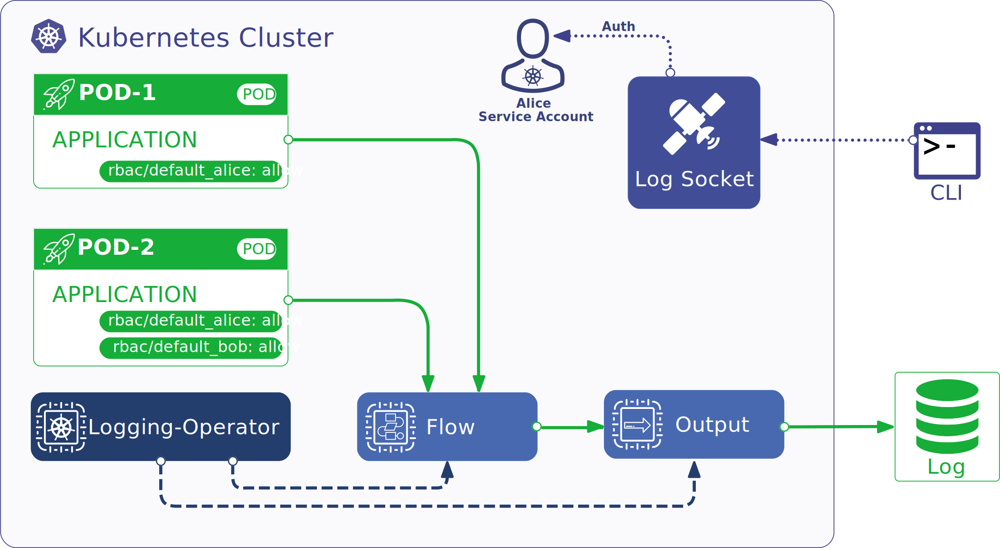
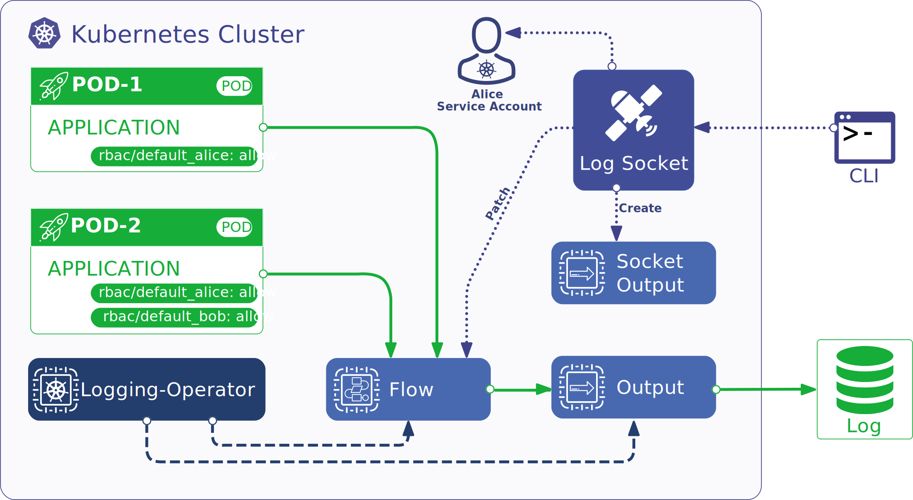
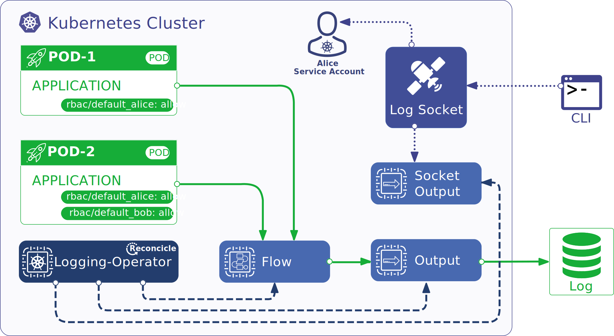
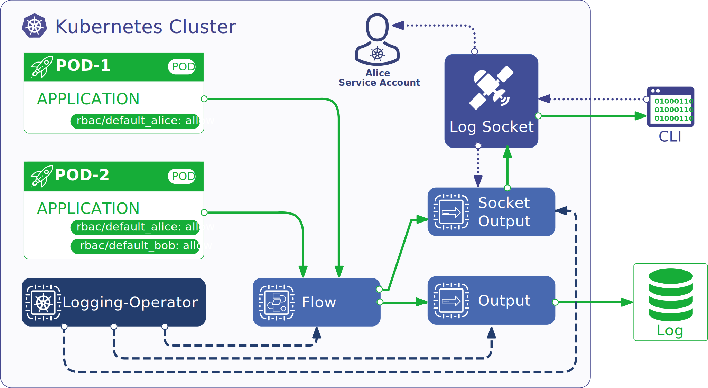
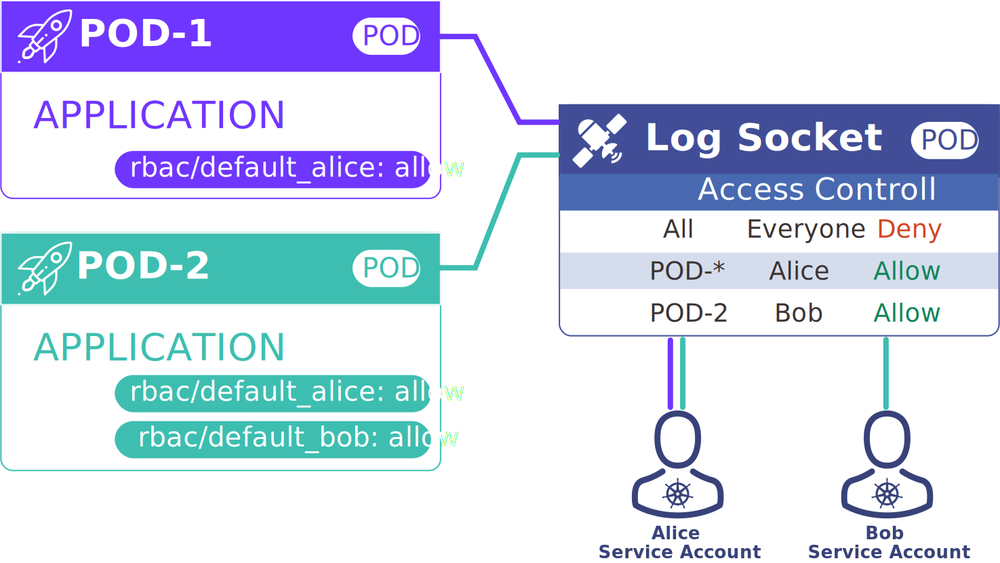

# Log socket

Log socket is a tool for streaming the live output traffic of a [logging-operator](https://github.com/banzaicloud/logging-operator/) flow.
The tool consists of *a command line tool* that you run on your local machine and *a service* running inside your cluster, acting as both an operator and an endpoint for the command line tool to connect to.

📽 You can see log-socket in action here: https://youtu.be/TWf1ho0XMyM 🍿

[](https://img.youtube.com/vi/TWf1ho0XMyM/0.jpg)

**Table of Contents**
1. [Deployment and usage](#deployment-and-usage)
1. [How it works](#how-it-works)

## Deployment and usage

### Deploying the service
The log-socket service has to be deployed in every cluster you want to be able to connect to and inspect flow output in.
The suggested way for deploying the service is by using the [official Helm chart](charts/log-socket).
The chart is not published yet, so for the moment you'll have to check out the repository and install from there
```sh
git clone https://github.com/banzaicloud/log-socket.git
cd log-socket
helm install log-socket ./charts/log-socket
```

### Installing the command line tool
The log-socket CLI has to be installed on every machine you want to stream logs to.
Currently, there are no binary releases available, so the easiest way to install the tool is by using `go install` (which requires that you have Go 1.18+ installed on your machine).
```sh
go install github.com/banzaicloud/log-socket/cmd/k8stail@latest
```

### Setting up RBAC
To set up RBAC for log-socket, all you need to do is add labels to pods you want to control access to.
For example, if you want to enable Alice (service account `acme/alice`) and Bob (service account `default/bob`) to access logs from pod `production/acme-app`, you have to add the labels `rbac/acme_alice: allow` and `rbac/default_bob: allow` to the `production/acme-app` pod.
By default, access is denied to all users.
To change the default, you can add the label `rbac/policy: allow` to pods.
To apply a set of rules to pods of a deployment, stateful set, job, etc., set labels in the resource's pod template.

### Streaming logs

> Prerequisites:
> * logging-operator is deployed inside the target cluster
> * log-socket service is deployed inside the target cluster
> * log-socket CLI is installed on your machine (and available in your PATH)
> * the target cluster is configured as the current context in your kubeconfig

Apart from the prerequisites, you should also have on hand your service account's token.
To get a service account's token, your can use the following command:
```sh
export TOKEN=$(kubectl get secret $(kubectl get sa <your service account name> -o=jsonpath='{.secrets[0].name}') -o=jsonpath='{.data.token}' | base64 -d)
```
This will save the service account token into the `TOKEN` environment variable.

To stream logs from the `default/flow1` flow, use the following command:
```sh
k8stail default/flow1 --token $TOKEN
```

In the command above, we assume:
* you have your service account token in the environment variable `TOKEN`
* there is a Kubernetes service in the `default` namespace with name `log-socket` forwading connections to port 10001 to the log-socket service pod
* you're permitted to use the K8s API server proxy

> If you have a custom deployment of the log-socket service, take a look at `k8stail`'s command line flags which will most likely offer a solution to access the service in such a configuration.

## How it works

Log-socket streams logs from the specified logging-operator flow inside a cluster to your local machine.
To achieve this, it relies on a service running inside the cluster and a command line tool on your machine.
The service acts
1. as a relay, receiving logs from flows and forwarding them to clients over WebSocket connections
2. as an operator, creating and modifying logging-operator resources to tap into log flows based on demand

When a user starts streaming logs using the client, the following things happen:
1. The CLI client connects to the service over HTTP(S).
   By default, this happens using the Kubernetes API server's proxy capability, addressing the service application through a K8s service resource.
   The client also specifies the flow (kind, namespace, name) to tap into and the user's credentials (service account token) for authentication.
   
2. The service accepts the connection and authenticates the user with the provided credentials.
   If authentication is successful, the HTTP connection is upgraded to a WebSocket connection and the new listener is registered.
   
3. Listener registration will trigger resource reconciliation in the service which makes sure that all required logging-operator output resources are present and tapped logging-operator flows are modified to include these outputs.
   For each tapped flow a single dedicated output is created that forwards logs to the service (over HTTP) regardless of the number of listeners for that particular flow (while there's at least one).
   The output's configuration includes the flow's identifiers (kind, namespace, name) in the target URL.
   For cluster flows, cluster outputs are created.
   
   
4. As logs arrive at the service, they are routed to listeners with the same requested flow as the log record's source flow.
   Filtering occurs before sending records to the listeners based on RBAC rules present in the record.
   Listeners that don't have permission to view the record get an error message instead indicating the record's source.
   
5. The client receives log records from the service over the previously opened WebSocket connection and prints them to the console.

When the client closes the connection or the connection is interrupted for any reason, the service unregisters the associated listener. This also triggers reconciliation which removes any unneeded outputs (and removes all references to these outputs from flows).

### RBAC
Log-socket supports role-based access control.
Clients connect to the service with a Kubernetes service account token.
The service uses this token to authenticate the client by creating a [K8s token review](https://kubernetes.io/docs/reference/kubernetes-api/authentication-resources/token-review-v1/).
Successful authentication returns the account's user information (name, groups, etc.) which is attached to the listener and used to filter log records before forwarding.

Permissions can be configured by labeling pods with the `rbac/<service account namespace>_<service account name>` label with a value of `allow` or `deny`, e.g. to allow the `system:serviceaccount:default:alice` account to read logs from the pod, add the `rbac/default_alice: allow` label.
Additionally, the default behavior can be changed by setting the `rbac/policy` label.

